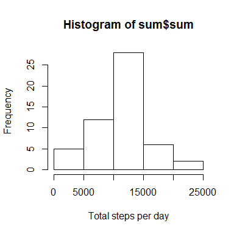
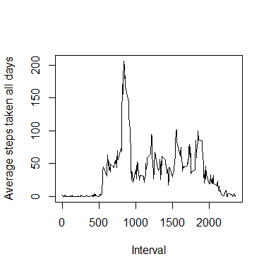
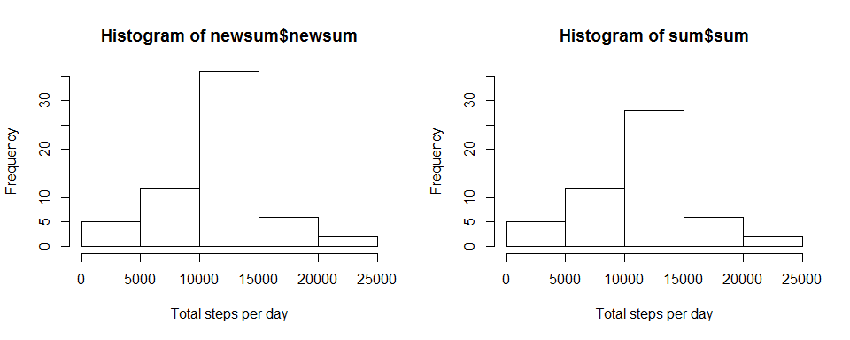

# Reproducible Research: Peer Assessment 1
May 16 2015  


## Loading and preprocessing the data

```r
##unzip the zipfile to get the original data
unzip("activity.zip", exdir=".")

##load the data
activity<-read.csv(file="activity.csv", header=TRUE)

##view data
head(activity)
```

```
##   steps       date interval
## 1    NA 2012-10-01        0
## 2    NA 2012-10-01        5
## 3    NA 2012-10-01       10
## 4    NA 2012-10-01       15
## 5    NA 2012-10-01       20
## 6    NA 2012-10-01       25
```

```r
str(activity)
```

```
## 'data.frame':	17568 obs. of  3 variables:
##  $ steps   : int  NA NA NA NA NA NA NA NA NA NA ...
##  $ date    : Factor w/ 61 levels "2012-10-01","2012-10-02",..: 1 1 1 1 1 1 1 1 1 1 ...
##  $ interval: int  0 5 10 15 20 25 30 35 40 45 ...
```

## What is mean total number of steps taken per day?

```r
##1. calculate total number of steps taken per day
sum<-tapply(activity$steps, activity$date, sum, simplify=TRUE)
sum<-data.frame(sum) ##convert sum from list to dataframe
head(sum) ##view sum
```

```
##              sum
## 2012-10-01    NA
## 2012-10-02   126
## 2012-10-03 11352
## 2012-10-04 12116
## 2012-10-05 13294
## 2012-10-06 15420
```


```r
##2. make histogram of total number of steps taken per day
hist(sum$sum, xlab="Total steps per day")
```

 

```r
##3. calculate the mean and median of the total number of steps taken per day
summary(sum$sum)
```

```
##    Min. 1st Qu.  Median    Mean 3rd Qu.    Max.    NA's 
##      41    8841   10760   10770   13290   21190       8
```

## What is the average daily activity pattern?

```r
##1. calculate average number steps across all days
ave<-tapply(activity$steps, activity$interval, mean, na.rm=TRUE,simplify=TRUE)
ave<-data.frame(ave) ##convert ave from list to dataframe for easy manupulation
colSums(is.na(ave)) ##check if any missing values in average steps per 5 min interval
```

```
## ave 
##   0
```

```r
ave$interval<-as.numeric(row.names(ave))
head(ave)
```

```
##          ave interval
## 0  1.7169811        0
## 5  0.3396226        5
## 10 0.1320755       10
## 15 0.1509434       15
## 20 0.0754717       20
## 25 2.0943396       25
```

```r
##draw the time series plot of the 5 min interval (x axis) vs average steps across all days (y axis)

plot(ave$ave~ave$interval, type="l", xlab="Interval", ylab="Average steps taken all days")
```

 

```r
##5-min interval contains the maximum number of steps
answer<-ave$interval[ave$ave==max(ave$ave)]
```
From this plot, we can figure out that the 5-min interval contains the maximum number of steps is 835

## Imputing missing values
Since missing value may introduce bias into some calculations of the data, it is better to check these values in the dataset:


```r
##1. count total # of missing values in activity
colSums(is.na(activity))
```

```
##    steps     date interval 
##     2304        0        0
```

There are many ways to fill in these missing values. If go back to the summary statistic calculated for total number of steps taken per day, we can see there are 8 NAs in the data i.e there are 8 days with no record at all. Therefore it is not a good strategy to use mean/median steps for that day to fill in the missing values. Since the data (ave) for average steps for 5-min interval across all days does not have any NA value, I decided to use the mean for that 5-min interval for filling in NA instead.


```r
##3. Create a new dataset with missing data filled in
##copy old activity dataset to new dataset
newactivity<-data.frame(activity)

##create a column of ave in new activity dataset for filling in missing value
unit<-data.frame(ave)

for(i in (1:60)){
    ave<-rbind(unit, ave)
}

newactivity$ave<-ave$ave

##get the index for each NA
index<-which(is.na(newactivity$steps))

##assign appropriate average of 5 min interval to NA and create a new activity dataset
newactivity$steps[index]<-newactivity$ave[index]
newdata<-newactivity[,1:3] ##remove extra column to make the new data as the old set
head(newdata)
```

```
##       steps       date interval
## 1 1.7169811 2012-10-01        0
## 2 0.3396226 2012-10-01        5
## 3 0.1320755 2012-10-01       10
## 4 0.1509434 2012-10-01       15
## 5 0.0754717 2012-10-01       20
## 6 2.0943396 2012-10-01       25
```

```r
##4. make histogram of the total number of steps taken each day and calculate the mean and median 
##calculate total number of steps taken per day
newsum<-tapply(newdata$steps, newdata$date, sum, simplify=TRUE)
newsum<-data.frame(newsum)

par(mfrow=c(1,2))
hist(newsum$newsum, xlab="Total steps per day", ylim=c(0,35)) ##histogram of the new dataset
hist(sum$sum, xlab="Total steps per day", ylim=c(0,35)) ##histogram of the old dataset
```

 

```r
summary(newsum$newsum) ##summary statistic for mean and median of the new set
```

```
##    Min. 1st Qu.  Median    Mean 3rd Qu.    Max. 
##      41    9819   10770   10770   12810   21190
```

```r
summary(sum$sum) ##summarty statistics for old set
```

```
##    Min. 1st Qu.  Median    Mean 3rd Qu.    Max.    NA's 
##      41    8841   10760   10770   13290   21190       8
```

Clearly the histogram of the new dataset is similar to the old dataset except the total steps per day in the range of 10000 to 15000. The new data has higher frequency in this range. The mean and median are identical when missing values are filled in suggesting that filling in missing value makes the distribution look more like a normal distribution.

## Are there differences in activity patterns between weekdays and weekends?

```r
##1. create a new factor variable in the new dataset with 2 levels: weekday and weekend
##convert the date variable to Date class
library(lubridate)
```

```
## Warning: package 'lubridate' was built under R version 3.0.3
```

```r
newdata$day<-as.Date(newdata$date)
newdata$day<-weekdays(newdata$day)

##merge all levels of the day variable into two levels: weekday and weekend
newdata$day<-as.factor(newdata$day)
levels(newdata$day) = list(weekday = c("Monday","Tuesday", "Wednesday", "Thursday", "Friday"), weekend = c("Saturday", "Sunday"))
table(newdata$day)
```

```
## 
## weekday weekend 
##   12960    4608
```

```r
##2. make a panel plot of 5 min interval (x-axis) vs average steps across all weekday or weekend days(y-axis)

##calculate average steps taken across all weekdays and weekends
library(dplyr)
```

```
## Warning: package 'dplyr' was built under R version 3.0.3
```

```
## 
## Attaching package: 'dplyr'
## 
## The following objects are masked from 'package:lubridate':
## 
##     intersect, setdiff, union
## 
## The following objects are masked from 'package:stats':
## 
##     filter, lag
## 
## The following objects are masked from 'package:base':
## 
##     intersect, setdiff, setequal, union
```

```r
data<-group_by(newdata, day, interval)
table<-summarize(data, steps=mean(steps, na.rm=TRUE))

##use lattice system to plot
library(lattice)
```

```
## Warning: package 'lattice' was built under R version 3.0.3
```

```r
xyplot(steps~interval|day, data=table, type="l", layout=c(1,2), xlab="Interval", ylab="Number of steps")
```

 
